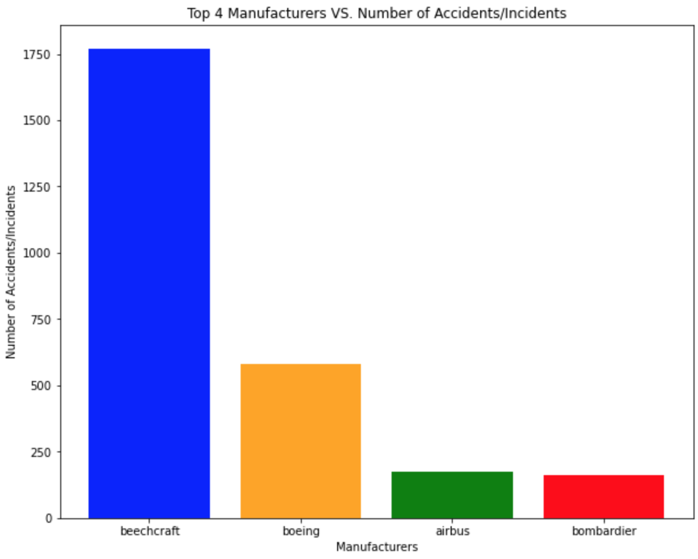
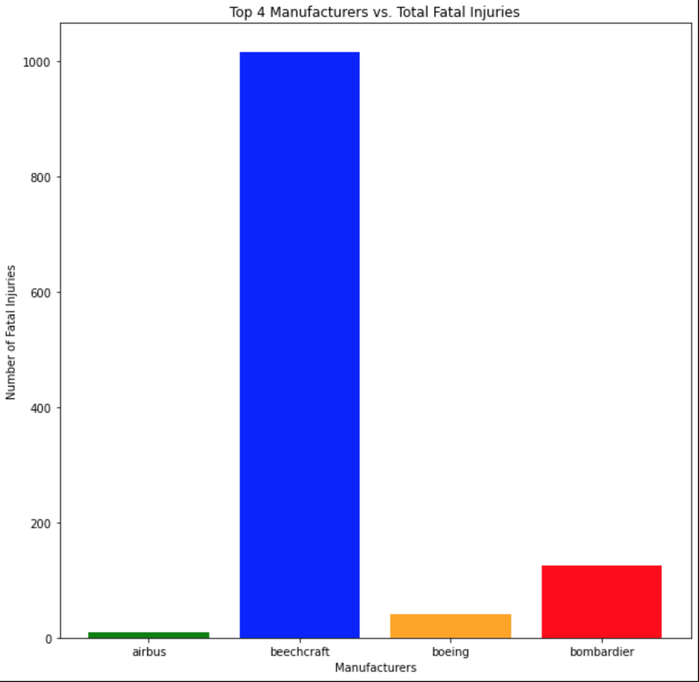
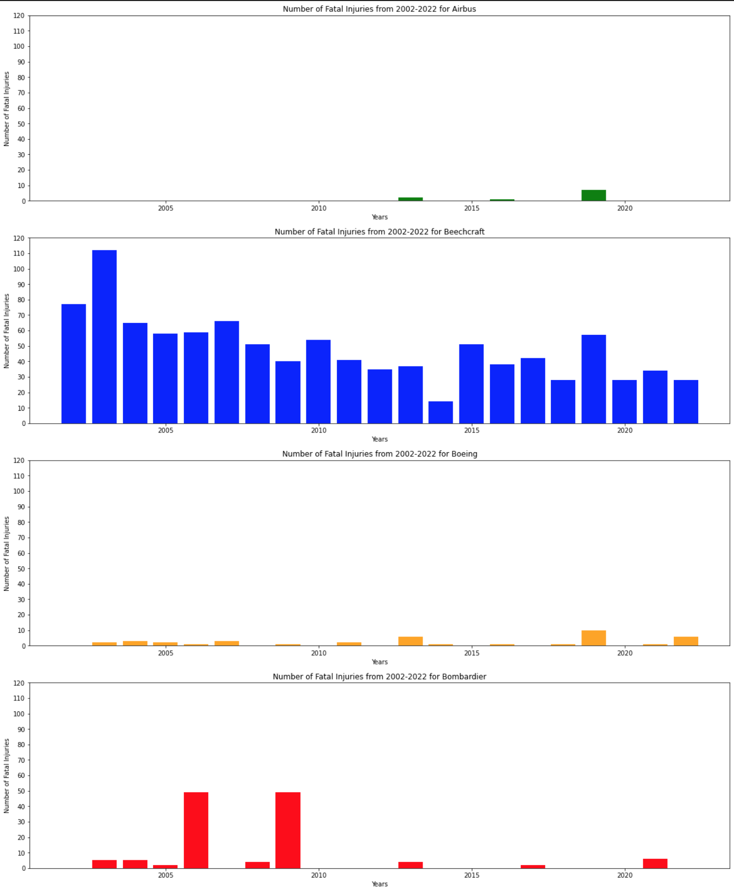
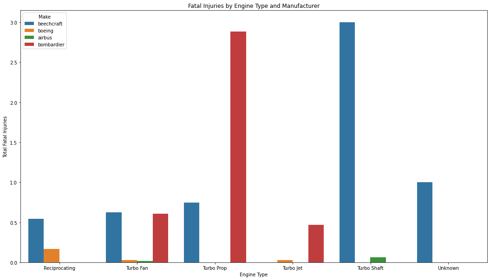

# Conquer the Sky: How do We Lift Off?

**Authors**: John Baumgartner, Mytreyi Abburu, Andreas Budhi


## Business Problem

 Our company is planning on expanding into the airplane industry. Our stakeholder, the head of the newly created aviation division, is eager to start spearheading this department. But, where do we start? We come in to assess the risk each airplane manufacturers and the type of airplane they make that will present the least risk for our first airplane. We did outside research to see which airplane manufacturers are the top 4 that we can pick. We then analyse these manufacturers and find which of them present with the least accidents and incidents along with number of fatal injuries in the past 20 years. Why are these metrics important for us to consider? As a new company, we want to establish a firm trust with our customers that we will provide the best way for your travel to your destination.


## Data Understanding

We were using dataset 'AviationData.csv' from the National Transportation Safety Board.  The data includes accident and incident data from 1962 to 2023 in the United States and beyond.

In this data, it contains 88889 entries with a total of 31 columns. 

## Data Analysis

Through outside resource, we determined that the best way to start is through reputation. Hence, we decided to restrict our exploration to the top 4 airplane manufacturers, and they are Beechcraft, Airbus, Boeing, and Bombardier.

We first added a new column 'Year' to better filter according to year. We then filtered the data to only include accidents after the year 2002 and that occurred in the United States only. 

We cleaned the 'Make' column of our data so that we could see the actual result of our top 4 manufacturers. To do this, we did a manual scanning of each misspelling and other varieties to describe value entry for the top 4 airplane manufacturers. We then set them to the same entry for each of the manufacturers.

In dealing with missing data, we determined that the count for the overall data justified our decision delete the missing data and based our analysis on the remaining data points.

Final dataset N = 2688


### Total Number of Accidents/Incidents for each of the Top 4 Airplane Manufacturers


In the past 20 years, Airbus and Bombardier had the least amount of Accidents/Incidents in the United States.


### Total Number of Fatal Injuries for each of the Top 4 Airplane Manufacturers


Again, we see that, in the past 20 years, Airbus and Bombardier had the least amount of Fatal Injuries in the United States

### Total Number of Injuries for each of the Top 4 Airplane Manufacturers


To continue with the trend we have been seeing so far, in the past 20 years, Airbus and Bombardier had the least amount of total Injuries in the United States.

### Total Fatal Injuries in the past 20 years by year and for each top 4 Manufacturers


In comparing these graphs, we see that Airbus has been consistent in the past 20 years in having the least amount of Fatal Injuries

### Total Number of Fatal Injuries for different Types of Engine for each of the Top 4 Airplane Manufacturers


This graphs tells us that, in the past 20 years, Turbo Shaft and Turbo Jet engine had the least amount of Fatal Injuries in the United States.

## Conclusion

Out of the top 4 manufacturers,, we recommend choosing Airbus manufactured airplanes that use either Turbo Jet and Turbo Shaft engine.

## Further Investigation

- Explore the prices of each plane and type engine to see whether new or used is more cost-effective.
- Research Airbus planes with Turbo Jet and Turbo Shaft engine.
- Research into Bombadier airplanes


## Additional Resources

- <p><a href="https://www.investopedia.com/ask/answers/050415/what-companies-are-major-players-airline-supply-business.asp#:~:text=Large%20Passenger%20Airplane%20Manufacturers,business%20for%20large%20commercial%20jets">Who are the Major Airplace Manufacturing Companies?</a></p>
- <p><a href="https://pilotinstitute.com/airbus-vs-boeing/">Airbus vs Boeing</a></p>
- <p><a href="https://www.aviationsafetymagazine.com/features/the-real-risks-of-engine-failures/">The Real Risks of Engine Failures</a></p>
- <p><a href="https://www.airpowerinc.com/types-of-aircraft-engines">Types of Aircraft Engines</a></p>

## Repository Structure

You are currently in the README.md file. The 'index.ipynb' file contains the jupyter notebook of the explaratory analysis of the given data that provides step-by-step guide to how we came to our conclusion. 'Images' file contains the images used in this file. The images were taken from the internet.

```
├── Data                <- Data file used in this project
├── Image               <- Images and Graphs used in this project obtained from external and internal source
├── index.ipynb         <- Jupyter notebook of the project containing codes and analysis
├── README.md           <- Both sourced externally and generated from code
└── images                   <- Both sourced externally and generated from code
```
